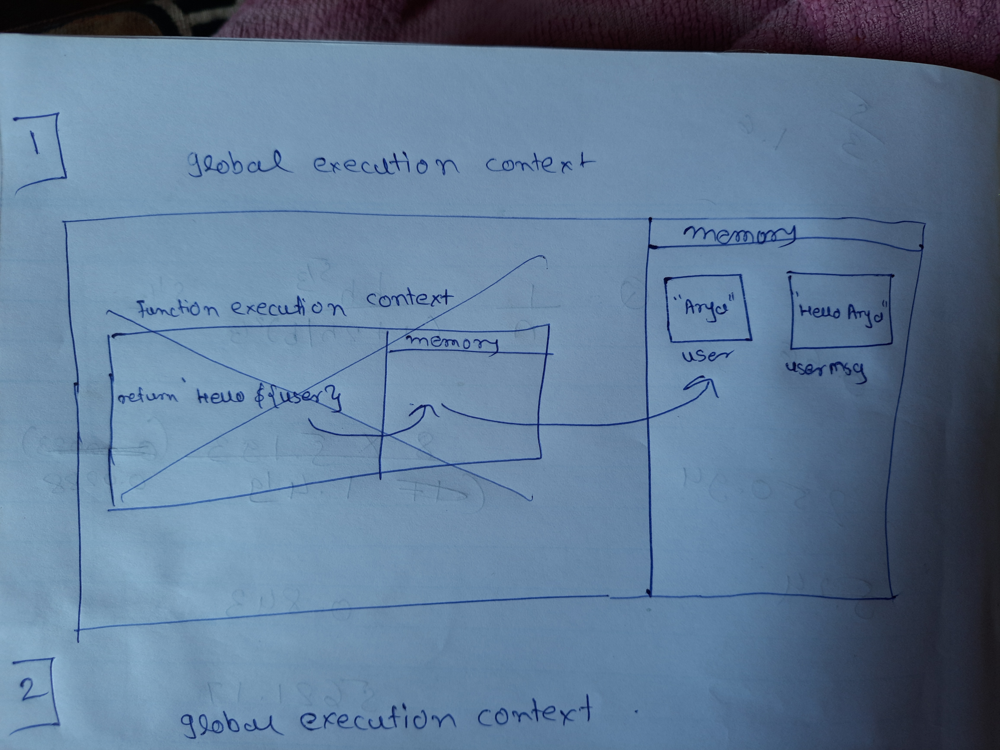
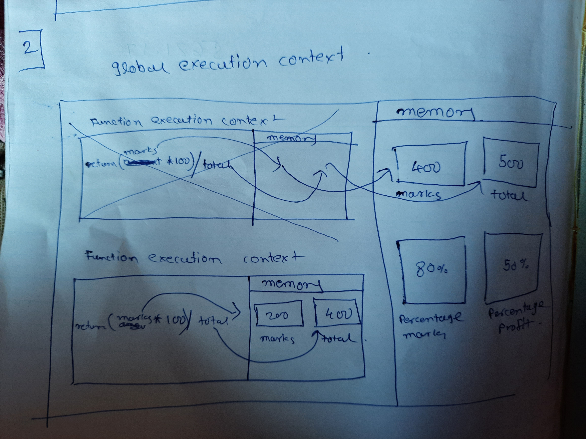
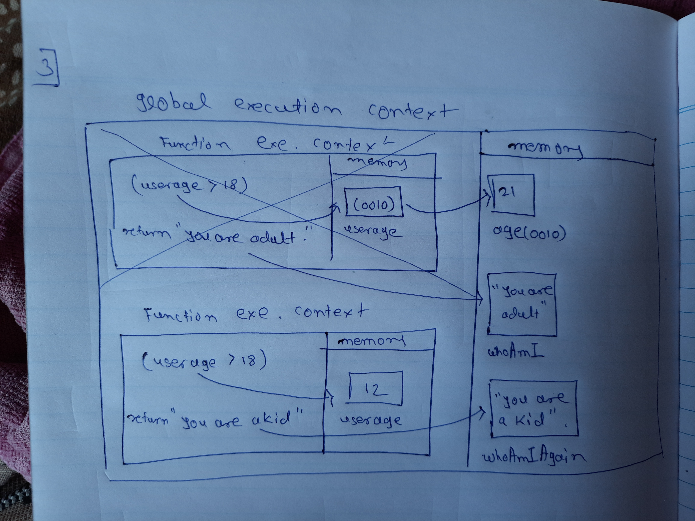

1. What does thread of execution means in JavaScript?
   --thread of execution means how javascript engine runs the cide.

2. Where the JavaScript code gets executed?
   --javascript code is executed in global execution context.

3. What does context means in Global Execution Context?
   --context means the enviornment in which we are executing code.

4. When do you create a global execution context.
   --every time need to execute JS code JS engine create one globat execution context.

5. Execution context consists of what all things?
   -execution context containts memory block and block to contain more function execution context.

6. What are the different types of execution context?
   --global and function

7. When global and function execution context gets created?
   --when we start executing JS file global is created and when we execute some function then function execution context ios created.

8. Function execution gets created during function execution or while declaring a function.
   --it is created while function execution.

9. Create a execution context diagram of the following code on your notebook. Take a screenshot/photo and store it in the folder named `img`. Use `` to display it here.

```js
var user = "Arya";

function sayHello() {
  return `Hello ${user}`;
}

var userMsg = sayHello(user);
```

<!-- Put your image here -->



```js
var marks = 400;
var total = 500;

function getPercentage(amount, totalAmount) {
  return (amount * 100) / totalAmount;
}

var percentageMarks = getPercentage(marks, total);
var percentageProfit = getPercentage(400, 200);
```

<!-- Put your image here -->



```js
var age = 21;

function customeMessage(userAge) {
  if (userAge > 18) {
    return `You are an adult`;
  } else {
    return `You are a kid`;
  }
}

var whoAmI = customeMessage(age);
var whoAmIAgain = customeMessage(12);
```

<!-- Put your image here -->


